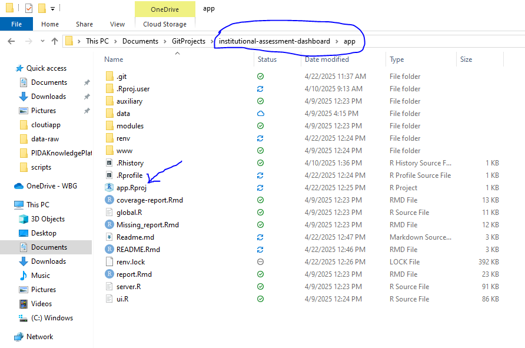
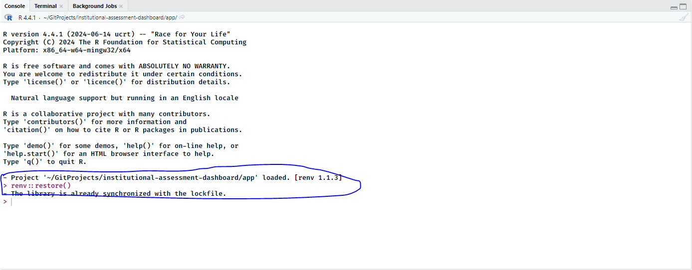
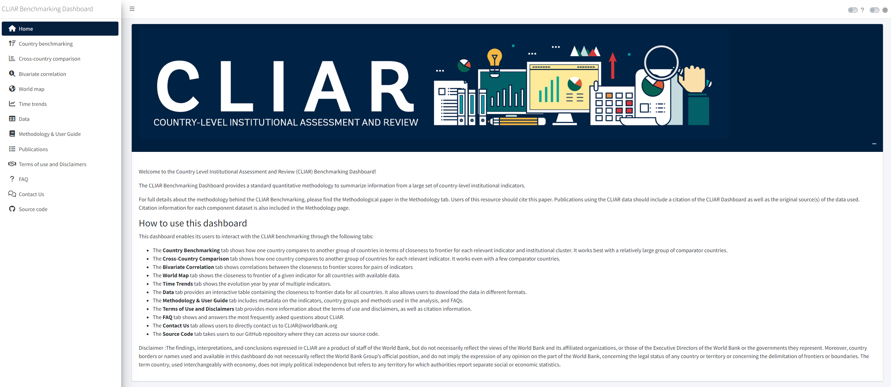

<!-- README.md is generated from README.Rmd. Please edit that file -->

# Reproducibility

To reproduce dashboard creation, first install R and RStudio
[here](https://posit.co/downloads/). Please go ahead and do the
following:

1)  Click the `app.Rproj` file in the base directory of this app folder.
    This will place you in the project environment for the app folder.

<!-- -->

2)  In your RStudio console, execute `renv::restore()`. Go ahead and
    select “Y” or “Yes” when instructed to install all package
    dependencies.

<!-- -->

3)  Open the `global.R` in this app folder. Go ahead and click `Run App`
    in the script of the window. A full reproduced app will look
    something like this on your local machine:

<!-- -->

You can find the published app
[here](https://datanalytics-int.worldbank.org/CLIAR/)
<!-- badges: start --> <!-- badges: end -->

# CLIAR Dashboard Overview

The Country Level Institutional Assessment and Review (CLIAR)
Benchmarking Dashboard is an interactive RShiny application designed to
facilitate the analysis and comparison of country-level institutional
indicators. It employs a standardized quantitative methodology to
summarize vast amounts of data and provide insights into institutional
performance across countries.

This tool is tailored for researchers, policymakers, and stakeholders
who need to evaluate and benchmark countries against institutional
indicators, view trends, analyze correlations, and access the underlying
datasets.

## Detailed Description of the CLIAR Dashboard’s Features

### 1. Introduction and Purpose:

The CLIAR Dashboard provides users with a consolidated platform to
assess institutional indicators at a country level using a quantitative
framework. It supports benchmarking, cross-country comparisons, and
temporal trend analysis, aiming to enhance decision-making and policy
formulation. The application emphasizes proper citation practices for
CLIAR’s methodology and the original datasets.

Key Functional Tabs:

### 2.Country Benchmarking:

Enables users to compare a country against a group of countries. Focuses
on “closeness to frontier” scores for institutional indicators and
clusters. Best suited for analyses with a broad set of comparator
countries.

### 3.Cross-Country Comparison:

Facilitates direct comparisons between countries for specific
indicators. Suitable even with a small number of comparator countries.

### 4.Bivariate Correlation:

Displays the correlation between two indicators’ “closeness to frontier”
scores.

### 5.World Map:

Visualizes “closeness to frontier” scores for a selected indicator
globally.

### 6.Time Trends:

Showcases the year-by-year evolution of multiple indicators.

### Data:

Provides a detailed, interactive dataset for all countries. Offers data
download capabilities in multiple formats.

### Methodology & User Guide:

Includes metadata, descriptions of country groupings, analytical
methods, and frequently asked questions.
