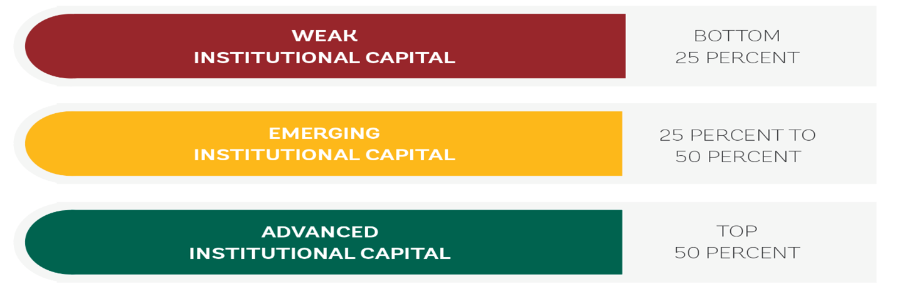

---
title:
output: 
  word_document:
    reference_docx: www/template.docx
    
params:
  base_country: NA
  variable_names: NA
  definitions: NA
  comparison_countries: NA
  data: NA
  family_data: NA
  data_dyn : NA
  family_data_dyn : NA
  rank: NA
  dots: NA
  group_median: NA
  threshold: NA
  family_order: NA
  global_data : NA
---


```{r, setup, include = FALSE}
knitr::opts_chunk$set(
  echo = FALSE,
  message = FALSE,
  warning = FALSE,
  fig.width = 9
)
```

```{r}

# Auxiliary functions -----------------------------------------------------------------

source(file.path("auxiliary",
                   "plots.R"))
source <- "Source: Authors’ elaboration using CLIAR’s Interactive Online Dashboard."
  
  note <- 
    paste0(
      "Note: ",
      "The bar reflects the simple average of the score for all subindicators included in a given institutional cluster. For each cluster, the x-axis shows the closeness to frontier \n
      (length of the bar), which captures the gap between a country’s performance and the best performer among countries for which data are available (global frontier). The large circles show ",
      params$base_country,
      "'s performance. The traffic lights coloring indicates areas where the largest institutional gaps exist in ",
      params$base_country,
      " relative to comparator countries, as follows: red = weak institutional capital; yellow = emerging institutional capital; green = strong institutional capital. See World Bank (2023) for a detailed discussion on the methodology as well as a detail description and sources of indicators in each institutional cluster."
    )
  
```

```{r}
knitr::include_graphics("www/cliar.png")
```


## Acronyms and Abbreviations

| Abbreviation | Description |
| ------------ | ----------- |
| CLIAR        | Country Level Institutional Assessment and Review |
| CSO          | Civil Society Organizations |
| CTF          | Closeness to Frontier |
| GTMI         | GovTech Maturity Index |
| SOE          | State-Owned Enterprise |
| UN           | United Nations |
| VDEM         | Varieties of Democracy Database |
| WB           | World Bank |


\newpage


# Introduction

This institutional assessment for **`r params$base_country`** is based on the CLIAR Benchmarking: an innovative approach that uses data from a multitude of global indicators and compares the country with relevant peers.

## What is CLIAR ? 
**The objective of the Country-Level Institutional Assessment and Review (CLIAR) is to provide a standardized and structured yet flexible analysis, with a rigorous and effective methodology.** The CLIAR would help country teams make meaningful comparisons across different institutional strengths and weaknesses, enabling them to measure the overall effectiveness of government institutions in a structured and consistent manner. The findings emerging from the CLIAR can assist teams in identifying institutional challenges that need to be addressed to achieve sustained, inclusive growth and inform the programming of Bank resources. The CLIAR aims to make the Bank’s institutional diagnostic work and policy dialogue at the country level more coherent and integrated, building on a solid empirical base.

**The Country Level Institutional Assessment and Review (CLIAR) is composed of two but complementary products: (i) the CLIAR Benchmarking and (ii) the CLIAR Country Deep-Dive.** This report is based on the former, namely the CLIAR Benchmarking.

**The CLIAR Benchmarking is a quick and accessible methodology that quantitatively assesses the strengths and weaknesses of a country’s institutional dimensions against a set of comparator countries.** A set of curated institutional indicators are aggregated institutional families so to empirically map the institutional capital across substantive issue areas. There are 13 institutional families, or clusters: (1) political institutions; (2) social institutions; (3) absence of corruption, (4) transparency and accountability institutions; (5) justice institutions, (6) public financial management institutions, (7) public sector human resources management, (8) digital government and data institutions; (9) business environment institutions; (10) labor and social protection institutions; (11) SOE corporate governance institutions; (12) service delivery institutions; and (13) climate change institutions. 

```{r, fig.cap="Institutional families"}

```

**The CLIAR Benchmarking generates systematic evidence needed to map out a country’s institutional profile, and it does so in a standardized, transparent, and replicable way.** This provides a robust data-driven base to guide the selection of a subset of issues related to the identified gaps that can be subject to in-depth investigation, as an inherent limitation of the benchmarking exercise is that it is not intended as an exhaustive and comprehensive analysis of the specific institutional constraints of each country and may not authoritatively identify all key institutional shortcomings, but rather as a basis for customizing it to the best extent possible to the country context and better engage into a “Country Deep-Dive”.

## Scoring and Aggregation Method
**The CLIAR Benchmarking analysis employs the “closeness to frontier” (CTF) methodology to standardize and compare a wide range of institutional indicators.** Each of the indicators is scored using the CTF where 1 is the best score is zero and is the worse. The individual indicator CTF scores are then averaged across the relevant institutional family to create the institutional level CTF score. Each country has up to 137 indicator level CTF scores (depending on data availability) and 13 institutional family level CTF scores. 

**Relative institutional weaknesses and strengths are then defined based on the percentile in which the specific indicator belongs, relative to the set of comparator countries (which are chosen by the country-team for each analysis).** Quantile distribution through traffic light coloring is then used to capture the areas where the largest institutional gaps exist, relative to the set of relevant country comparators. The current methodology classifies “weak institution”, “emerging institution”, and “advanced institution”, as those in the following percentiles: 0-25th, 25-50th, above 50th. (There is also the option of using terciles: 0-33rd, 33-66th, above 66th.) 

**The CTF and the quantile analysis capture two related but different aspects of a country’s institutional performance.** The CTF compares the country’s performance with the best and worst performers. The quantile analysis benchmarks the country’s performance with the set of comparator countries. For example, it could be that for one indicator or institutional cluster the CTF score is relatively high and close to 1 (indicating in fact “closeness to the frontier”) but, at the same time, this dimension is marked as an institutional weakness (i.e., red color) because the country’s performance is still worse than most comparator countries. The benchmark analysis shows both dimensions to assess the country’s performance with respect to both the global frontier and the performance of all other comparator countries.

## Static vs. Dynamic Analysis 
**We implement two types of distinct yet complementary benchmarking analyses, namely a static and a dynamic version.**

# Country Overview

## CLIAR Benchmarking
**The World Bank Country-Level Institutional Assessment and Review (CLIAR) framework was used in order to assess the quality of institutional arrangements in** `r params$base_country` **vis-à-vis a set of comparator countries**. 


# Static Benchmarking

The static analysis of `r params$base_country` institutions was performed on a basis of `r length(unique(params$data$var_name))` available indicators that are grouped in `r length(unique(params$data$family_name))` institutional clusters (families). 

```{r}
temp<-params$family_data%>%
  filter(country_name %in% c(params$base_country))%>%
  mutate(flag = ifelse(dtt > 0.5, 1, 0))

counts_category<-params$family_data%>%
  filter(country_name %in% c(params$base_country))%>%
  group_by(status)%>%
  summarize(count = n(),VarNames = sapply(list(var_name), function(x) paste(x, collapse = ", ")))
```

`r sum(temp$flag)` institutional families out of `r length(unique(params$data$family_name))` exhibit a proximity to the frontier greater than 0,5, which means that `r sum(temp$flag)` institutional clusters are closer to the world’s best performers. In relative terms, as shown in Figure below, scores for `r counts_category$count[counts_category$status=="Weak\n(bottom 25%)"]`  institutional clusters namely `r counts_category$VarNames[counts_category$status=="Weak\n(bottom 25%)"]` indicate weak performance, `r counts_category$count[counts_category$status=="Emerging\n(25% - 50%)"]`  of the clusters namely `r counts_category$VarNames[counts_category$status=="Emerging\n(25% - 50%)"]` are classified as ‘emerging’ and `r counts_category$count[counts_category$status=="Strong\n(top 50%)"]` clusters namely `r counts_category$VarNames[counts_category$status=="Strong\n(top 50%)"]` demonstrate an advanced performance. 

## Country overview

```{r}
params$family_data %>%
  static_plot(
    params$base_country,
    "Country overview",
    rank = params$rank,
    group_median = params$group_median,
    dots = params$dots,
    title = FALSE,
    note = paste(
      source,
      str_wrap(note, 174),
      sep = "\n"
    ),
    threshold = params$threshold
  )

```


# Institutional families

```{r, results = "asis"}
families <-
  params$family_order %>%
  select(family_name) %>%
  unlist

  if (length(families) > 0) {

    family_names <-
      paste(families, collapse = ", ")


    for (family in families) {

      vars <-
        variable_names %>%
        filter(family_name == family) %>%
        select(var_name) %>%
        unlist


      filtered_list <- vars[!grepl("Average", vars)]


      cat(
      "\n####",family)

      cat(
       "\n",
      "In the static benchmarking case, this institutional cluster is analyzed with",
      length(filtered_list),
      "available indicators:",
      sapply(list(filtered_list), function(x) paste(x, collapse = ", "))
      )

      data <-
        params$data %>%
          filter(var_name %in% vars)

      try(
        plot(
          static_plot(
            data,
            params$base_country,
            rank = params$rank,
            dots = params$dots,
            family,
            title = FALSE,
            note = source,
            threshold = params$threshold
          )
        )
      )
      cat("\n")
    }

  }


```

# Dynamic Benchmarking
```{r,results = "asis"}
families <-
  params$family_order %>%
  select(family_name) %>%
  unlist

  if (length(families) > 0) {

    family_names <-
      paste(families, collapse = ", ")


    for (family in families) {

      
      cat(
      "\n####",family)
      
      vars <-
        variable_names %>%
        filter(family_name == family) %>%
        select(var_name) %>%
        unlist
      
      data_dyn <-
        params$data_dyn %>%
          filter(var_name %in% vars)

    
    indicators<-unique(data_dyn$var_name)
    
    if(length(indicators)>0){
    
        for (i in seq(1, length(indicators), by = 2)) {
            pair <- indicators[i:(i + 1)]
            # Process the pair of elements here
            
          
        
        data_dyn_sub <-data_dyn%>%
          filter(var_name %in% pair)
    
          try(
            plot(
              static_plot_dyn(
                data_dyn_sub,
                params$base_country,
                rank = params$rank,
                dots = params$dots,
                family,
                title = FALSE,
                note = source,
                threshold = params$threshold
              )
            )
          )
        }   
          
          
    }
          cat("\n")
        }

  }


```
\newpage 

# Appendix A - Additional methodological details.

The CLIAR Benchmarking is based on XX indicators spanning the period between 1990 and 2022. These indicators are largely drawn from the EFI360 database, complemented by a small set of additional data sources that capture dimensions considered important for the analysis but that have not yet been included in the EFI360 platform. Indicators are selected based on two types of complementary and parallel reviews: (a) qualitative review, ensuring that the indicators selected are publicly available, conceptually relevant to each institutional family and of high quality (e.g., reputable institution, data collection and methodology) and (b) quantitative review, based on an assessment of indicator coverage for both country and year, with a particular focus on coverage for the last 5 years (i.e., 2018-2022). In particular, for the quantitative review we provide the following guiding criteria for inclusion (but exceptions are made on a case-by-case basis): 
* **Continuity**: The indicator must be updated at least once in the past five years. 
* **Country Coverage**: The indicator must cover 100 countries at least once over the past 5 years.
* **Year Coverage**: We include only variables that have at least 2 years of data (not per country but overall). Additionally, for each year to count, coverage must be of at least 10 countries.  

The CLIAR Benchmarking analysis employs the “closeness to frontier” (CTF) methodology to standardize and compare a wide range of institutional indicators. The CTF methodology facilitates the assessment of a country’s performance across institutional indicators by comparing it with the “global frontier,” which corresponds to the world's best performer. For each indicator, a country's performance, y, is rescaled on a 0–1 scale using a linear transformation (worst–y)/(worst–frontier), where 1 represents the best performer and 0 the worst performer. The higher the score, the closer a country is to the best performer and the lower the score, the closer a country is to the worst performer, and more distant to the frontier. The best and worst performers are identified using available data from the global sample (i.e., considering all countries for which data are available) across the last five years data coverage (i.e., 2018-2022). Next, for each institutional category, the CTF scores obtained for each indicator are aggregated through simple averaging into one aggregated CTF score. This captures the overall performance for a category relative to the “global frontier.” Performance across indicators helps to identify priority areas for institutional strengthening.
Relative institutional weaknesses and strengths are then defined based on the percentile in which the specific indicator belongs, relative to the set of comparator countries (which are chosen by the country-team for each analysis). Quantile distribution through traffic light coloring is then used to capture the areas where the largest institutional gaps exist, relative to the set of relevant country comparators. The current methodology classifies “weak institution”, “emerging institution”, and “advanced institution”, as those in the following percentiles: 0-25th, 25-50th, above 50th. (There is also the option of using terciles: 0-33rd, 33-66th, above 66th.) 

```{r, fig.cap="Traffic light coloring, as used in the institutional benchmarking exercise", out.width = "100%"}

```

The CTF and the quantile analysis capture two related but different aspects of a country’s institutional performance. The CTF compares the country’s performance with the best and worst performers. The quantile analysis benchmarks the country’s performance with the set of comparator countries. For example, it could be that for one indicator or institutional cluster the CTF score is relatively high and close to 1 (indicating in fact “closeness to the frontier”) but, at the same time, this dimension is marked as an institutional weakness (i.e., red color) because the country’s performance is still worse than most comparator countries. The benchmark analysis shows both dimensions to assess the country’s performance with respect to both the global frontier and the performance of all other comparator countries.


# Appendix B - Description of CLIAR Indicators

```{r,  results = "asis"}
for (family in names(definitions)[1:length(names(definitions))-1]) {
  cat("\n",
      family,
      "\n")
  
  print(
    knitr::kable(
      definitions[[family]],
      format = "pipe"
    )
  )
  
  cat("\n")
  
}
```

# Appendix C - Summary Statisics

#### Static Benchmarking Summary
```{r,  results = "asis"}

summary_data <-
  params$data %>%
  filter(country_name %in% c(params$base_country,params$comparison_countries))

summary_stats <- summary_data %>%
  group_by(var_name) %>%
  summarise(
    Mean = mean(dtf),
    SD = sd(dtf),
    Q25 = quantile(dtf, 0.25),
    Q50 = quantile(dtf, 0.50),
    Q75 = quantile(dtf, 0.75),
    Min = min(dtf),
    Max = max(dtf),
    N = n()
  )

summary_stats<-summary_stats%>%
  mutate_if(is.numeric, ~round(., 2))

print(
  knitr::kable(
    summary_stats,
    format = "pipe"
  )
)


```
#### Dynamic Benchmarking Data Summary
```{r,  results = "asis"}

summary_data <-
  params$data_dyn %>%
  filter(country_name %in% c(params$base_country,params$comparison_countries))

summary_stats <- summary_data %>%
  group_by(var_name) %>%
  summarise(
    Mean = mean(dtf),
    SD = sd(dtf),
    Q25 = quantile(dtf, 0.25),
    Q50 = quantile(dtf, 0.50),
    Q75 = quantile(dtf, 0.75),
    Min = min(dtf),
    Max = max(dtf),
    N = n()
  )

summary_stats<-summary_stats%>%
  mutate_if(is.numeric, ~round(., 2))

table <- knitr::kable(
  summary_stats,
  format = "pipe"
)


# Print the styled table
print(table)

```

#### Missing Stats  Summary
```{r,  results = "asis"}

missing_stats <- params$global_data%>%
  filter(country_name %in% c(params2$base_country,params2$comparison_countries))

missing_stats$Missing_Indicators <- apply(missing_stats, 1, function(row) {
  paste(Hmisc::label(missing_stats)[which(is.na(row))],collapse = ', ')
})

missing_stats<-missing_stats[,c('country_name','Missing_Indicators')]

print(
  knitr::kable(
    missing_stats,
    format = "pipe"
  )
  
)

```

