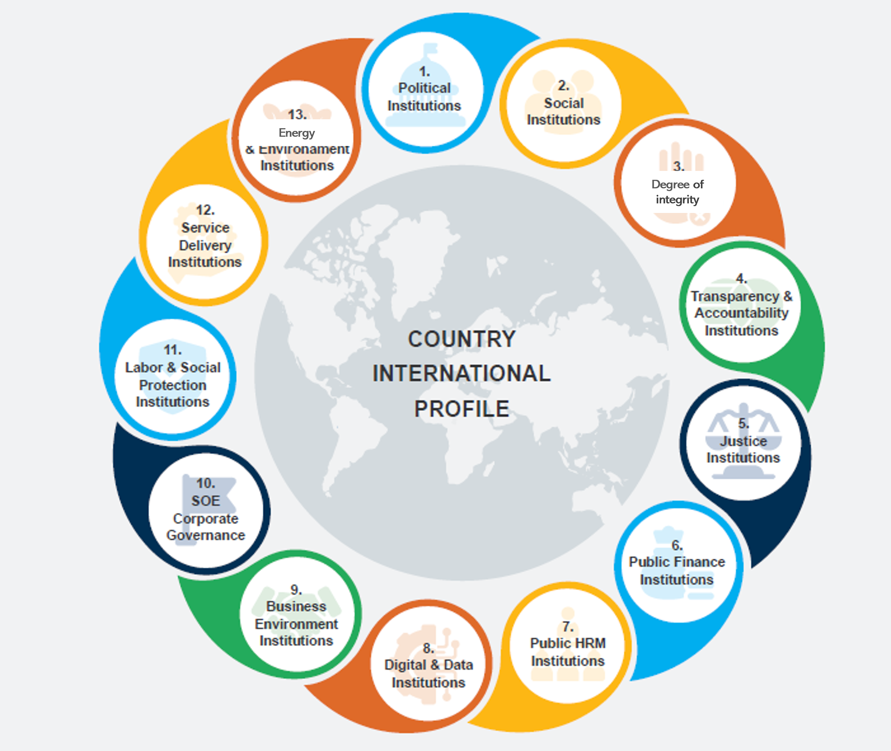

---
title:
output: 
  word_document:
    reference_docx: www/template.docx
    
params:
  base_country: NA
  variable_names: NA
  definitions: NA
  comparison_countries: NA
  data: NA
  family_data: NA
  rank: NA
  dots: NA
  group_median: NA
---


```{r, setup, include = FALSE}
knitr::opts_chunk$set(
  echo = FALSE,
  message = FALSE,
  warning = FALSE,
  fig.width = 9
)
```

```{r}

 # Auxiliary functions -----------------------------------------------------------------

  source(file.path("auxiliary",
                   "plots.R"))

  source <- 
    "Source: Authors’ elaboration using CLIAR’s Interactive Online Dashboard."
  
  note <- 
    paste0(
      "Note: ",
      "The bar reflects the simple average of the score for all subindicators included in a given institutional cluster. For each cluster, the x-axis shows the closeness to frontier \n
      (length of the bar), which captures the gap between a country’s performance and the best performer among countries for which data are available (global frontier). The large circles show ",
      params$base_country,
      "'s performance. The traffic lights coloring indicates areas where the largest institutional gaps exist in ",
      params$base_country,
      " relative to comparator countries, as follows: red = weak institutional capital (bottom 25 percent); yellow = emerging institutional capital (25 percent–50 percent); green = strong institutional capital (top 50 percent). See World Bank (2021) for a detailed discussion on the methodology as well as a detail description and sources of indicators in each institutional cluster."
    )
```

```{r}
knitr::include_graphics("www/cliar.png")
```

# Methodology

1. **The World Bank Country-Level Institutional Assessment and Review (CLIAR) framework was used in order to assess the quality of institutional arrangements in** `r params$base_country` **vis-à-vis a set of comparator countries**. This exercise generates the empirical evidence needed to map out the country's institutional profile, and identifies its institutional strengths and weaknesses. The main advantage of the benchmarking analysis is that it offers a standardized, transparent, and replicable approach to identify key institutional areas where the performance may be deficient relative to that of comparator countries. This provides a robust empirical base to guide the selection of a subset of issues related to the identified gaps that can be subject to in-depth investigation. Despite these advantages, the benchmarking analysis has limitations, discussed in Appendix C.  

2. **The benchmarking exercise clusters an array of well-established institutional indicators into nine institutional families**. There is no agreed theoretical framework that could guide the categorization process. The categorization process faces a trade-off between aggregation and narrowness, where the categories have to be broad enough to comprehensively capture the main indicators and policy spaces but also focused enough to guide an in-depth qualitative analysis as well as a productive dialogue in the country. The proposed categories, described in more detail in Appendix A, are based on an effort to balance this trade-off and capture key functions that different institutions perform (Figure 1): Anticorruption, transparency, and accountability; Business environment and trade; Financial market; Labor market; Justice; Political; Public sector; Social; and SOE corporate governance. The institutional benchmarking uses more than 80 indicators collected from a variety of data sources in order to provide a snapshot of governance and institutions according to the latest available international indicators, as of 2020. Details on the indicators used for the institutional benchmarking are provided in Appendix B.

```{r, fig.cap="Institutional families"}

```

3. **The benchmarking exercise employs the “closeness to frontier” (CTF) methodology to standardize and compare a wide range of institutional indicators**. The CTF methodology facilitates the assessment of a country’s performance across institutional indicators by comparing it with the “global frontier,” which corresponds to the world's best performer. For each indicator, a country's performance is rescaled on a 0–1 scale using a linear transformation (worst–y)/(worst–frontier), where 1 represents the best performer and 0 the worst performer. The higher the score, the closer a country is to the best performer and the lower the score, the closer a country is to the worst performer, and more distant to the frontier. The best and worst performers are identified using available data from the global sample (i.e., considering all countries for which data are available) across the last five years. In the case of `r params$base_country`, we use indicators for 2014–20 (or a shorter period if data are not available). Next, for each institutional category, the CTF scores obtained for each indicator are aggregated through simple averaging into one aggregated CTF score. This captures the overall performance for a category relative to the “global frontier.” Performance across the indicators will help identify priority areas for institutional strengthening.

4. **Relative institutional weaknesses and strengths are defined based on the percentile in which the specific indicator belongs, relative to the set of comparator countries**. Traffic light coloring indicates where the largest institutional gaps exist relative to the comparator countries, based on the following categories (Figure 2): “weak institution” (bottom 25 percent—red), “emerging institution” (25–50 percent—yellow), and “advanced institution” (top 50 percent—green). For `r params$base_country`, the chosen set of comparator countries include: `r paste(params$comparison_countries, collapse = ", ")` The comparators were chosen based on **[... FOR TEAMS TO COMPLETE]**. 

```{r, fig.cap="Traffic light coloring, as used in the institutional benchmarking exercise", out.width = "100%"}
knitr::include_graphics("www/colors.png")
```

# Country overview

```{r}
params$family_data %>%
  static_plot(
    params$base_country,
    "Country overview", 
    rank = params$rank,
    group_median = params$group_median,
    dots = params$dots,
    title = FALSE,
    note = paste(
      source,
      str_wrap(note, 174),
      sep = "\n"
    )
  )
```

# Institutional families

```{r,  results = "asis"}
for (category in c("Strong", "Emerging", "Weak")) {

  families <-
    params$family_data %>%
    filter(country_name == params$base_country,
           str_detect(status, category)) %>%
    select(var_name) %>%
    unlist
  
  if (length(families) > 0) {

    family_names <-
      paste(families, collapse = ", ")

    cat("\n##",
        category,
        "institutional capital:",
        family_names,
        " \n")

    for (family in families) {

      vars <-
        variable_names %>%
        filter(family_name == family) %>%
        select(var_name) %>%
        unlist

      cat(
        "\n###",
        family,
        " \n"
      )

      data <-
        params$data %>%
          filter(var_name %in% vars)

      try(
        plot(
          static_plot(
            data,
            params$base_country,
            rank = params$rank,
            dots = params$dots,
            family,
            title = FALSE,
            note = source
          )
        )
      )
      

      cat("\n")
    }

  }
}

```

# Appendix A - Institutional families

**Political institutions** relate to the political regime and mechanisms that regulate relationships between different parts of the government (electoral rules, political parties, and rules that delineate the functions of a government), including institutions that facilitate participation of vulnerable groups (such as ethnic representation and gender quotas). The indicators included in this category assess the extent to which certain institutional functions and mechanisms are in place, including constraints on government powers, political stability, voting rights, political competition, civil liberties and fundamental rights, and distribution of political powers across gender, social groups, and socioeconomic positions. Social institutions refer to concepts such as social norms, beliefs, trust, and civic cooperation, and coincide largely with informal institutions. The literature on social institutions also studies social capital, civic engagement, and social networks.

**Anti-corruption, transparency, and accountability institutions** capture whether the existing institutional setting is effective in holding public actors accountable, promoting integrity across the public administration, and curbing corruption. These include e-government and Open Data initiatives, citizens' access to information, and the government's efforts, as well as citizens' active participation in the fight against corruption.

**Public sector institutions** correspond to laws, regulations, and policies that deal with the design, implementation, and enforcement of regulations that organize and guide state and public service delivery. Government effectiveness can be compromised by limited coordination among agencies, the weak role of regulatory agencies, competing legislation, lack of monitoring activities, or poor internal management capacity. "Center of government" refers to the institution or group of institutions that supports a country's chief executive (president or prime minister) in leading the political and technical coordination of critical government actions, strategic planning, monitoring of performance, promoting innovation, and communicating on the government's decisions and achievements. These institutions are becoming increasingly relevant in a context where an increasing number of cross-cutting issues demand "whole-of-government" approaches and coherent responses. Justice institutions vary from public- or state-devised institutions, to private institutions, which are realized through contracts. Justice institutions are important across a vast range of issues, including property rights, enforcement of legislation, the effectiveness and independence of the judicial system, and impartial enforcement of laws by courts and other actors.

**Business environment and trade institutions** overlap --- in part --- with justice institutions and refer to rules that govern the market, such as the legal system, enforcement of property rights, trade and firm regulations, regulatory governance, credit markets, business and labor market regulations, and so on. Indirectly, indicators included in this cluster (such as measures burden on custom procedures, nontariff trade barriers, and business regulations) provide an interesting proxy for the extent to which institutions are "captured" by narrow interests.

**Labor market institutions** describe the laws and regulations and organizations that shape the labor market and the relationships between workers and employers, including employment security for permanent and temporary workers, employees covered by collective agreements, organization of workers into unions, and the legislative mandate on minimum wages.

**Financial market institutions** refer to the rules governing the banking and financial sectors as well as the oversight and monitoring of these sectors by public bodies, including credit market regulations, the banking and financial market supervisory authorities, or regulation of competition. This cluster also considers the constraints faced by private actors, such as limitations to ownership of foreign bank accounts and barriers to access to credit, and the degree of state intervention, for example, through direct or indirect public ownership of banks and other financial firms.

**Governance of state-owned enterprises (SOEs)** captures whether the state has a predominant role in service delivery through SOEs, such as in the utility sectors. Rather than passing judgement on whether state intervention in service delivery is a desirable feature or not, it considers whether the state operates according to market rules and in equal terms relative to other private actors in the same market. The quality of these types of institutions depends on how tariffs are set, whether there are laws and regulations that limit competition, the degree of SOEs' autonomy in making market-related decisions, and whether SOEs are required to provide clear and transparent information to customers on tariffs and consumption.

# Appendix B - Indicator definitions

```{r,  results = "asis"}
for (family in names(definitions)) {
  cat("\n##",
      family,
      "\n")
  
  print(
    knitr::kable(
      definitions[[family]],
      format = "pipe"
    )
  )
  
  cat("\n")
  
}
```

# Appendix C - The risks and limitations of the benchmarking analysis

**Data coverage.** Ultimately, the quality of a benchmarking exercise is a function of the quality and availability of the indicators used for the analysis. The cross-country indicators used can have significant limitations and might fail to capture important information relative to the institutional functions under analysis. They may also not be updated regularly and/or not be available for the whole set of countries of interest. There is also a risk in focusing only on what is known from the international media and official government sources, which are often the main sources of cross-country expert assessments but do not necessarily reflect the perception and views of ordinary citizens and local actors on the ground (World Bank, 2020). Finally, important functional areas worth exploring are simply not subject to a benchmarking analysis due do the lack of international benchmarking indicators. A clear example of this is the governance of climate change, where there is a clear gap in quantitative data available both in terms of spatial and temporal coverage. While this limits the scope of the benchmarking exercise, new indicators are being constantly developed and produced, requiring a process to regularly update the selection of indicators considered for the institutional benchmarking and---possibly---revise the organization of the institutional clusters.

**Form vs. function.** Many governance and institutional indicators have a normative bias and reflect specific institutional forms more than they capture performance relative to a given function. This bias reflects the notion that development could be accelerated through transplanting institutional forms and laws developed in high-income countries which would in turn facilitate institutional and functional convergence (Andrews et al 2017). In contrast, being able to assess institutional functions can help to make sense of the multiple historical trajectories of institutional change around the world and the role that institutions and governance play in policy effectiveness (World Bank 2017). For the institutional benchmarking exercise, the team prioritized, whenever possible, institutional indicators capturing functions rather than forms, but this choice was limited by the quality of data.

**Expert assessments vs. objective measures.** Some indicators are based on expert assessments or perception surveys. While there have been efforts to complement expert assessments with alternative measurement methods, the objective measurement of some dimensions is hindered by their hidden or complex nature (such as corruption, or the quality of the legal system) and the fact that---when available---such granular data are not comparable across countries. Some dimensions of institutional performance identified in this methodological note are necessarily subjective, such as those related to trust and values captured by public opinion surveys. These are critical elements that shape social cohesion and influence the business climate in a country, with significant implications for growth, poverty, and inequality. That said, this subjective element needs to be considered when interpreting results and, where possible, such findings need to be complemented and corroborated with country-specific sources and additional qualitative analysis.

**Processes vs. outcomes.** The choice of the proposed indicators for the institutional analysis seeks to distinguish institutional processes (laws, regulations, norms) from development outcomes. For example, the CLIAR is not concerned with the unemployment rate in the country but rather labor market institutions, such as employment regulations, that affect unemployment rates. While this distinction is clear in some domains, it is debatable in others. For example, corruption can be perceived as an intermediate outcome, being the product of transparency, accountability, independence of the judiciary, and cultural norms and, at the same time, having implications on the business climate, attractiveness of foreign investments, and the overall economy of a country.

**Normative bias.** In the CTF methodology, the frontier is --- by definition --- the highest possible value ("monotonicity assumption"). While this is not problematic for indicators like "political stability," for other types of indicators this interpretation can raise some doubts. For example, strong labor market regulations and employment protection can pose some trade-offs between economic and social policy objectives. While it is desirable to protect workers from unfair dismissals and guarantee a respectable minimum income, strong labor market regulations can discourage firms or incentivize the informal economy. Identifying the optimal strength of labor market regulations is ultimately a normative and political choice that requires balancing these trade-offs and considering the costs and benefits for all social groups in a country-specific setting. This goes beyond the scope of this analysis, and therefore, for the sake of simplicity and transparency, we adopt the monotonicity assumption for all institutional dimensions considered in the analysis. This limitation needs be considered, however, when interpreting the results of the empirical analysis.

**Formal vs. informal institutions.** Given the challenges associated with the effort to capture empirically informal institutions and the limited availability of cross-country data in this regard, the benchmarking exercise tends to be biased toward formal institutions. An important exception is the category of social institutions, which captures important manifestations of informal institutions such as social norms, beliefs, and social capital and trust. This bias toward formal institutions is an additional limitation of the quantitative analysis, as in many countries informal institutions often play an important role in shaping actors' expectations and behavior. The qualitative analysis is intended to address---at least in part---this shortcoming and is addressed specifically.

**The limitations outlined above suggest that the benchmarking exercise is --- at best --- an "exercise of approximation."** It is not intended as an exhaustive and comprehensive analysis of the specific institutional constraints of each country and may not authoritatively identify all key institutional shortcomings. The tool should therefore be used only as an initial effort to bring well-structured evidence into the discussion of institutional challenges, as a basis for customizing it to the best extent possible to the country context. Most importantly, this is only the first step of the CLIAR, which provides an opportunity to address limitations and gaps experienced in the benchmarking with the qualitive analysis that follows.
